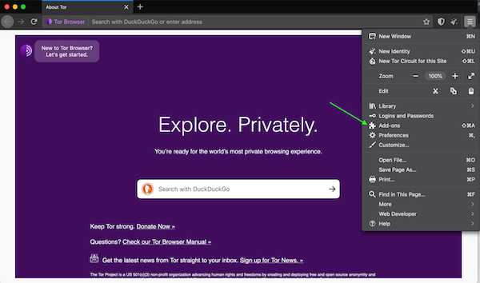
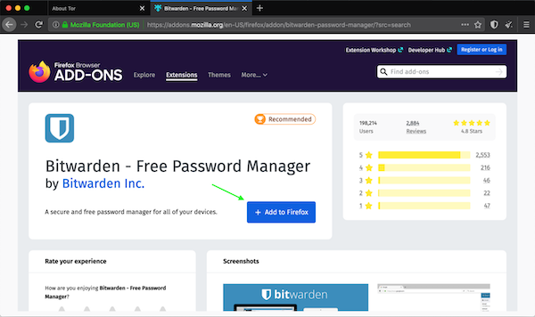
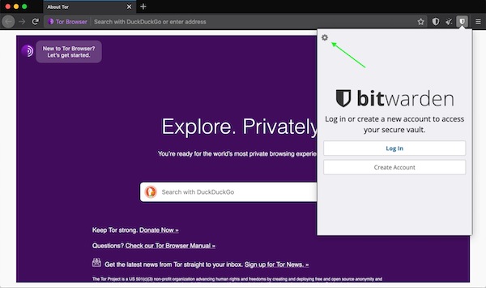
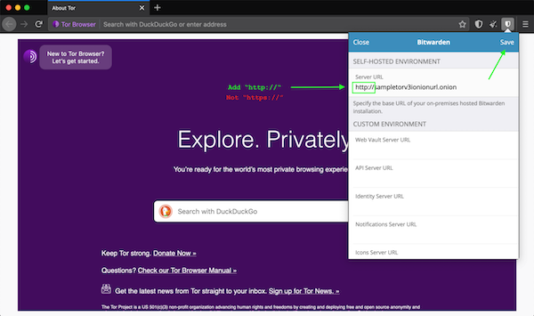
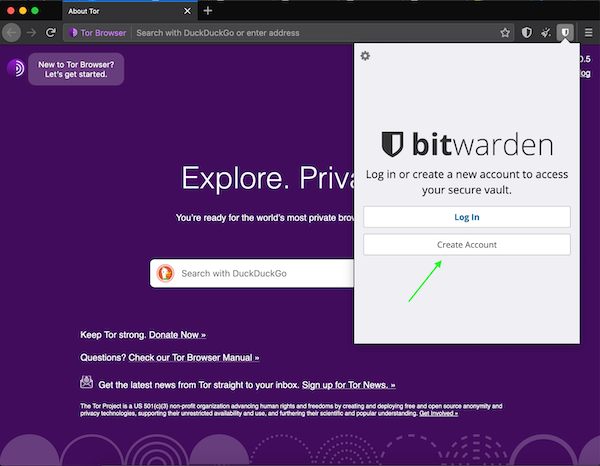

# Usage Instructions

**You can use Bitwarden with Firefox (Socks5 Proxy enabled) or Tor Browser.**

1. Open the browser and visit the add-ons section.

3. Search for “Bitwarden” and click “Add to Firefox”.

4. Access the Bitwarden settings.

5. Copy your Bitwarden Tor Address from your Companion App and paste it into the “Self Hosted Environment” → “Server URL” field. Add “http://” (*not* https://) to the frontend of the onion URL. Then click “Save”.

6. Click “Create Account” and fill in the required fields.

This *does not* mean you are creating an account with Bitwarden or any other third party. You are creating an account with yourself on your own Embassy. It’s awesome!

## Keep in Mind

Bitwarden on the Embassy is a *self-hosted* password manager, which means your passwords physically live on your Embassy. Be sure to create backups and keep them safe. If you lose your Embassy or uninstall Bitwarden, and you have not made a backup, all your passwords will be gone forever.