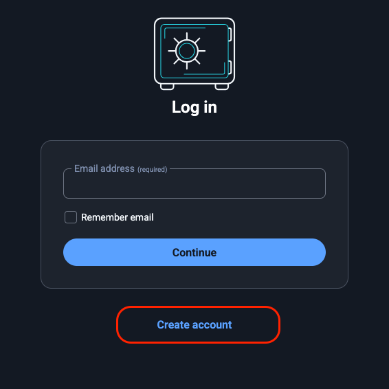
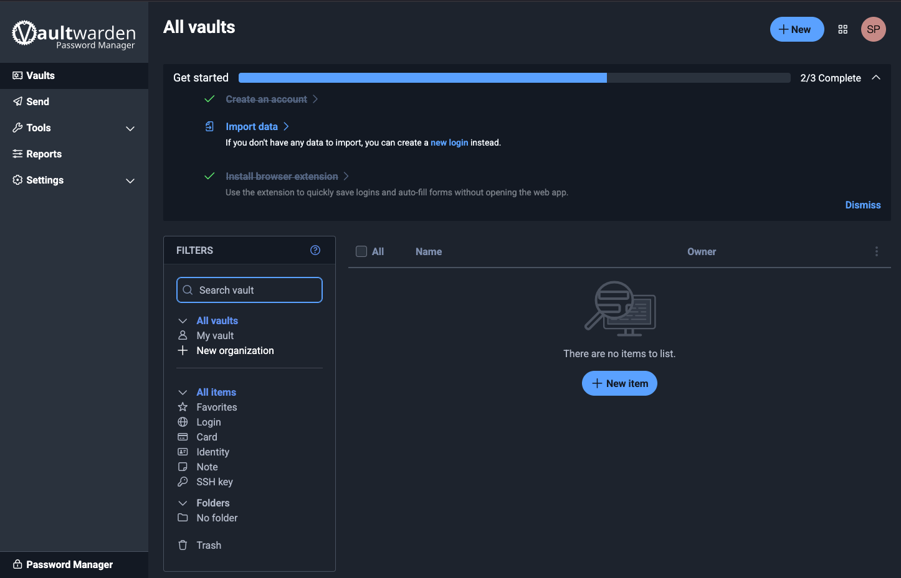
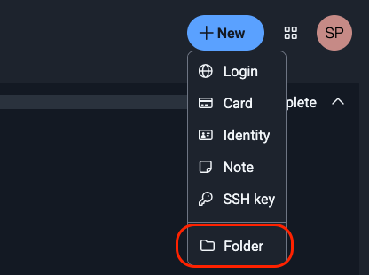
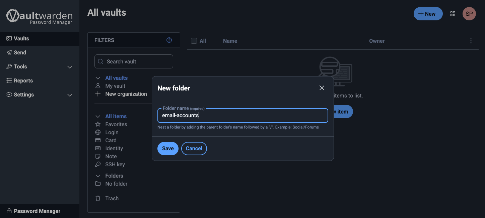
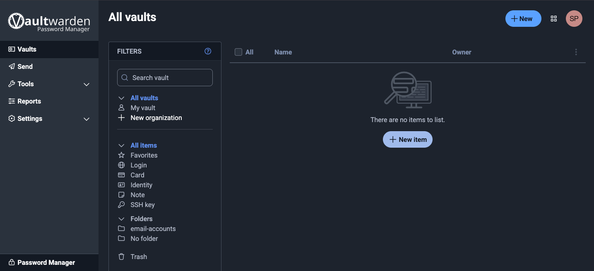
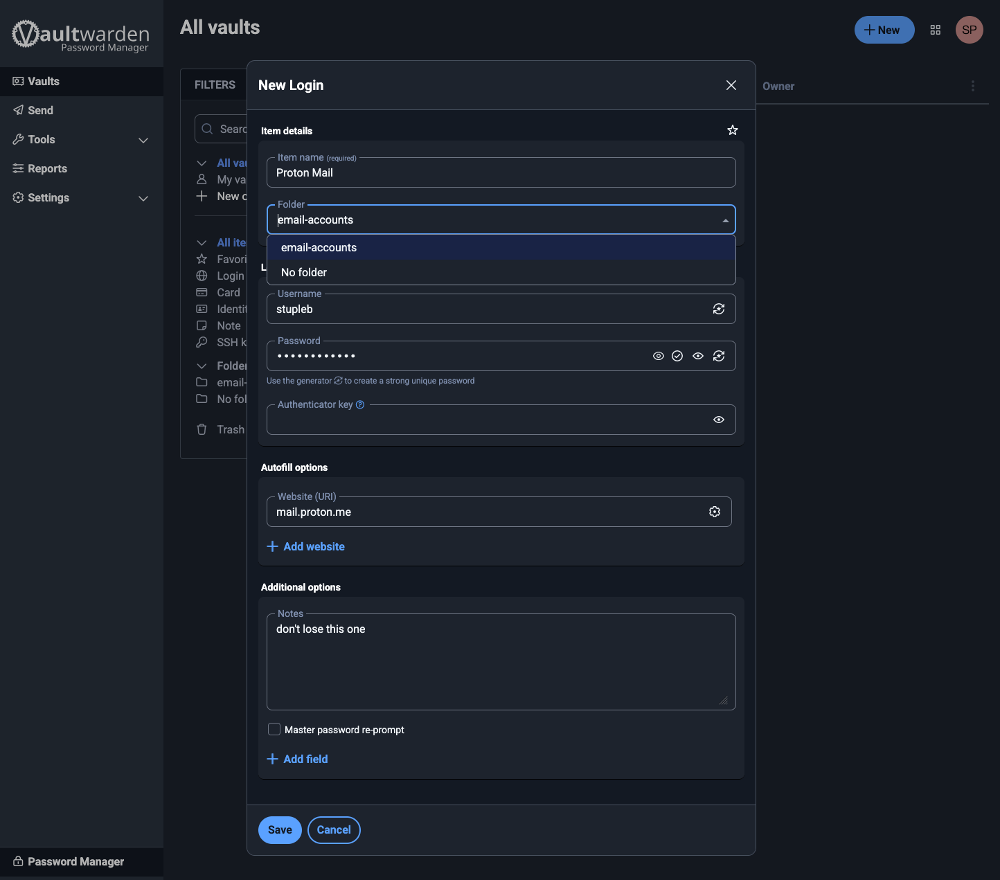
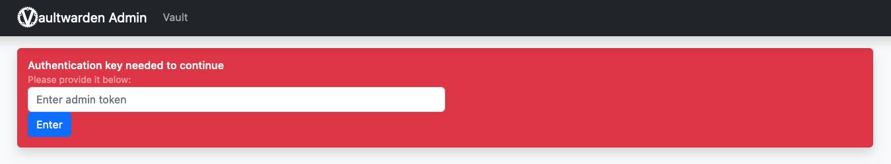
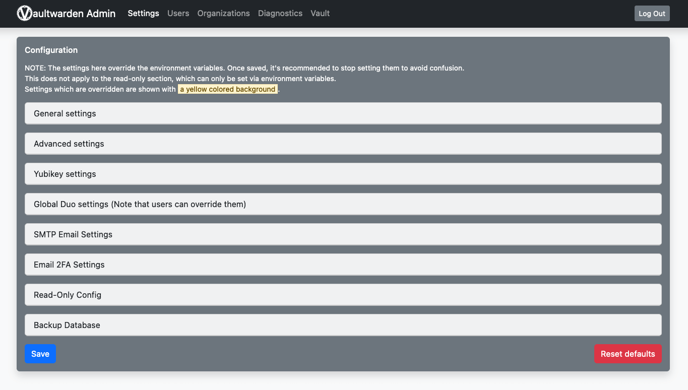

# Vaultwarden

Vaultwarden is a _self-hosted_ password manager, which means your passwords physically live on your StartOS server. Be sure to create backups and keep them safe. If you lose your StartOS data drive or uninstall Vaultwarden, and you have not made a backup, all your passwords will be lost forever.

Vaultwarden is a community-maintained, lightweight unofficial Bitwarden-compatible server. If you currently have a hosted account with Bitwarden, you can export your data from that account and import it to your Vaultwarden service on your Start9 Server using the built-in import/export features in any Bitwarden application!

**Contents**
- [Web Vault](#web-vault)
- [Admin Panel](#accessing-the-admin-panel)
- [Organizations](#organizations)
- [Bitwarden Client Setup](#bitwarden-client-setup)
- [SMTP Configuration](#smtp-configuration)

## Getting Started

1. On first install, StartOS will prompt you to generate and admin token. In the `Tasks` section, find this required task and click on the triangular icon.

1. A token will be generated and you will be asked to save it in a secure location. (This token is used to log into the Admin Portal where settings, users and organizations can be managed - no access to users passwords, which are encrypted)

1. Start Vaultwarden, and when started and in a healthy state, launch the standard Web Vault UI for the first time.

### Web Vault

#### Account Creation

1. Create an account for yourself on this, you're own self-hosted Vaultwarden server. Enter an email address and a master password.

    

    **Note:** The email address you enter can be anything you like. It doesn't have to be real. It is simply a way for you to log into Vaultwarden from Bitwarden apps on your devices. You cannot use this email address to reset your master password - it is simply used to create an account on your server. If you lose your master password, your saved passwords will be inaccessible forever.

    **Warning:** It is important to realize that this is the Master password for all your other passwords. Make it very strong, memorize it, write it down, and back it up to a safe place. If you lose it, you may lose access to all your passwords and your entire digital life.

1. Log in with your username and password to be greeted with a newly set up Vaultwarden vault.

    

1. On the left, you can access Tools for reports and the password generator. You can also import data from other programs, such as LastPass, 1Password, or KeePass!

1. Account settings gives you all your options, including the ability to set up two-factor authorization.

#### Storing your first password

1. Back at the main page for your vault, let's do a quick example login. We'll start by creating a folder for it:

    

1. Name the folder and click **Save**:

    

1. You can now add items to that folder. Click **New item**

    

1. Now add the credentials and click **Save**:

    

    An entry can have multiple URLs - for example you may wish to enter both an onion address and a .local address for one of the services you have running on your server. We are increasing the number of ways in which you can connect to your services, soon they may even have simple .com addresses!

1. And there we have it - our first set of login credentials.

    

    Congratulations! You have set up your own self-hosted password manager and have added a set of login credentials to it!

    **Note:** It likely isn't practical to manually add passwords to the vault, then manually retrieve them each time you want to log in. This is where broswer plugins and mobile apps come in. See the section below on **Bitwarden Client Setup**.

### Accessing the Admin Panel

1. From `Vaultwarden > Service Interfaces` launch the Admin Portal interface.

1. Remember the Admin Token you generated when you first installed Vaultwarden? Enter that now.

    

1. Once logged into the Admin Panel you'll be presented with the main options. 

    

## Organizations

While you can change settings and manage individual user accounts in the Admin Panel, one of the more important features if you're using Vaultwarden in a business or within a family are Organizations. Organizations in Vaultwarden are shared, encrypted vaults for teams or groups. They let multiple users share logins, notes, and credentials safely. 

### Creating an Organization

1. In your Web Vault, click `New Organization`

1. Give your organization a name and enter your email (you can use anything you want).

### Adding Others to Your Organization

1. Tell the user to create an account on your Vaultwarden server. This must be done *before* you invite them.

1. Inside the Organization page, click `Members > Invite member`

1. Decide what permissions you want the member to have and click "Save". In the below example, the member will be a manager.

1. The new member should automatically show as `Needs confirmation`. If the user shows as `Invited`, remove their account by clicking the settings icon to the right of their email address, and make sure they create account *before* you invite them.  Once they show as `Needs confirmation`, select the user's checkbox and click the settings icon on the right and click "Confirm selected".

1. You will be presented with a fingerprint phrase. The new member can verify this phrase inside their own dashboard, but because you are self-hosting and adding users manually, you can just click "Confirm".

    The new member should now be able to see the organization in their own dashboard or client apps.

## Bitwarden Client Setup

It likely isn't practical to manually add passwords to the vault, then manually retrieve them each time you want to log in. This is where browser plugins and mobile apps come in.

- [Browser Extension](integrations/browser-extension.md)
- [Android](integrations/android.md)
- [iOS](integrations/ios.md)
- [Desktop Clients](integrations/desktop.md)

## SMTP Configuration

To set SMTP credentials for your Vaultwarden server, use **Actions > Configure SMTP** from your Vaultwarden service page. _Do not_ use the admin portal; any credentials entered into the admin portal will be overwritten the next time Vaultwarden is started.