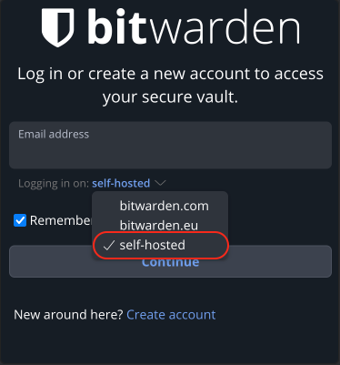
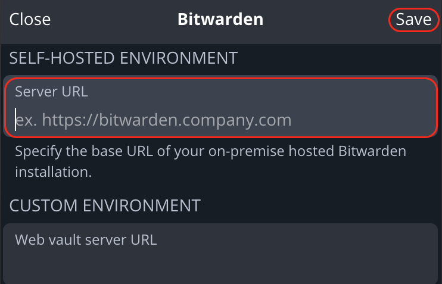

# Bitwarden Browser Extension

The Bitwarden browser extension will connect to your self-hosted Vaultwarden server right inside your browser, allowing you to auto-fill website passwords, add newly created passwords to your Vaultwarden and to create and use passkeys.

1. In this example we will use Firefox, though these instructions will work just the same for Brave. First, install the Bitwarden browser extension… [Firefox](https://addons.mozilla.org/en-US/firefox/addon/bitwarden-password-manager/) | [Brave](https://chromewebstore.google.com/?utm_source=ext_app_menu).

1. Head to the **Interfaces** section in the Vaultwarden service on your Start9 Server and indentity the type of interface you'd like to use.

1. Copy the preferred interface address.

1. Open Bitwarden extension and click the **self-hosted** dropdown menu and choose **self-hosted**. Paste your interface address to **Server URL** field and click save.

   

   

1. Enter your credentials and the Bitwarden extension will be logged into your self-hosted Vaultwarden server!

**Tor Users Only**

If you intend on connecting via **Tor** (i.e using the .onion address) rather than VPN or Clearnet ( [see: Connecting Remotely](https://docs.start9.com/user-manual/connecting-remotely/index.html) ) the Bitwarden browser extension will only work with a Tor enabled browser.

If you choose **Firefox with Tor**, you will need to [follow this guide](https://docs.start9.com/misc-guides/firefox-guides/tor.html) to run Tor on your device and configure Firefox to use it. If using **Brave** you will just need to [setup Tor on your device](https://staging.docs.start9.com/user-manual/connecting-remotely/tor.html). With Tor Browser, everything will just work right out of the box.

We recommend using Firefox as it is the most compatible browser with Start9 Servers.