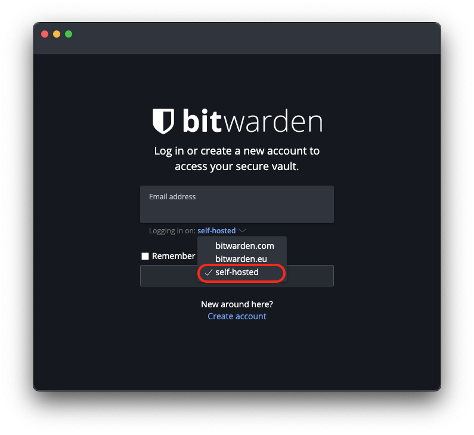
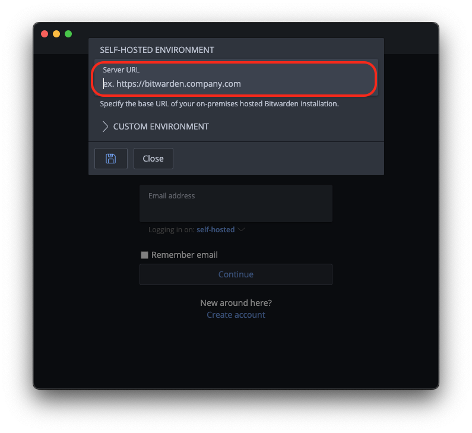

# Bitwarden Desktop Client 

Using the Android client it is possible to replace the default Google password management with your own self-hosted one that Bitwarden will connect to. This allows you to save passwords and passkeys for Android apps as well as websites.

- [Linux](#linux)
- [MacOS](#macos)
- [Windows](#windows)

## Linux

1. Install Bitwarden either by using a package manager like **apt** or download it from [here](https://bitwarden.com/download/).

   **Note:** If you intend to use Tor, run the program with the flag `--proxy-server=socks5://127.0.0.1:9050` behind it. You can run this from a terminal, and if you'd like to use a shortcut, edit that shortcut file to include the flag.

1. Head to the **Interfaces** section in the Vaultwarden service on your Start9 Server and indentity the type of interface you'd like to use.

1. Copy the preferred interface address.

1. Choose the **Self-hosted** option, paste the preferred interface address for VPN, LAN or Tor:

1. Click save and log in.

## MacOS

1. Download the [Bitwarden Desktop app](https://bitwarden.com/download/).

   **Note:** If you intend to use Tor, make sure Tor is [running on your Mac](https://docs.start9.com/user-manual/connecting-remotely/tor.html). If you intend to use a VPN, make sure you have it [running on your Mac](https://docs.start9.com/user-manual/connecting-remotely/vpn.html).

1. Head to the **Interfaces** section in the Vaultwarden service on your Start9 Server and indentity the type of interface you'd like to use.

1. Copy the preferred interface address.

1. Click the **Self-hosted** option, paste the preferred interface address for VPN, LAN or Tor:

   

   

1. Click save and log in.

## Windows

1. Download the [Bitwarden Desktop app](https://bitwarden.com/download/).

   **Note:** If you intend to use Tor, make sure Tor is [running on your Windows](https://docs.start9.com/user-manual/connecting-remotely/tor.html). If you intend to use a VPN, make sure you have it [running on your Windows](https://docs.start9.com/user-manual/connecting-remotely/vpn.html).

1. Head to the **Interfaces** section in the Vaultwarden service on your Start9 Server and indentity the type of interface you'd like to use.

1. Copy the preferred interface address.

1. Click the **Self-hosted** option, paste the preferred interface address for VPN, LAN or Tor:

1. Click save and log in.
