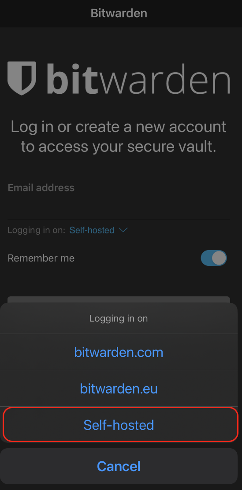
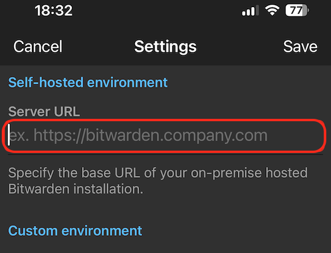

# Bitwarden iOS Client

## iOS

1. Visit the App Store and download the [Bitwarden app](https://apps.apple.com/app/bitwarden-password-manager/id1137397744)

1. Head to the **Interfaces** section in the Vaultwarden service on your Start9 Server and indentity the type of interface you'd like to use.

1. Copy the preferred interface address.

   **Note:** If connecting via **Tor** rather than VPN (i.e using the .onion address) the Bitwarden app will only work if [Tor is enabled](/device-guides/android/tor.md) on your device and Bitwarden is added to Orbot's VPN apps list. You may need to hit the refresh button in the top left to get it to populate.

1. Open the Bitwarden app. Tap the **self-hosted** dropdown menu and choose **self-hosted**. Paste your interface address to **Server URL** field and tap save.

   **Note:** For **Tor**, before you hit save: If the Tor address you have copied begin with **http** - Please change this to **https** instead of **http**

   

   

1. Tap **Log In**, enter your credentials, and you'll be able to access your Bitwarden app / Vaultwarden server!